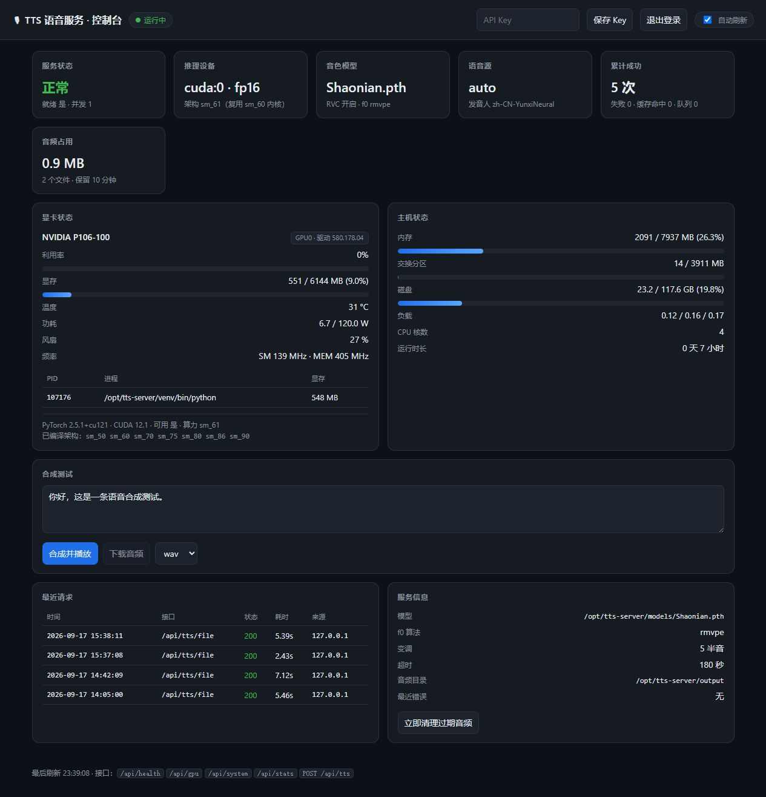

# AstrBot AI 自动语音回复系统（tts-with-rvc）

[](https://github.com/yake1145141/voice-tts-system/actions/workflows/tests.yml)
[](LICENSE)
[](https://www.python.org/)

> 📖 **不想看长文档？直接去文档站：[rvc-tts.top](https://rvc-tts.top/)**
> —— 左侧目录导航，包含从硬件选型到部署、配置、排障的完整教程。

## 🇨🇳 国内拉取加速

GitHub 直连慢或者连不上？在地址前面加上 `https://gh-proxy.cn/` 就能加速：

```bash
# 直连（国外网络）
git clone https://github.com/yake1145141/voice-tts-system.git

# 国内加速（推荐国内用户用这条）
git clone https://gh-proxy.cn/https://github.com/yake1145141/voice-tts-system.git
```

Release 里的发布包、安装脚本、以及文档里的其它 GitHub 链接，用同样的方法在地址前面加前缀即可。

> 加速服务由 **[gh-proxy.cn](https://gh-proxy.cn)** 提供，使用帮助见 **[www.gh-proxy.cn](https://www.gh-proxy.cn/)**。
> 纯公益加速站，国内拉 GitHub 代码、Release、raw 文件都很快，推荐收藏。

让 AstrBot 的 AI 回复**自动变成语音**：拦截 AI 文本 → 过滤括号/中括号里的动作与情绪描写
→ 调用 **tts-with-rvc**（Edge TTS `zh-CN-YunxiNeural` + 指定 RVC 模型）生成音频
→ 作为**语音消息**发送。

> **核心原则：能语音就语音，不能语音就文字。任何环节失败都绝不会让 AI 原本的文字回复丢失。**

```text
                    ┌────────────────────┐
                    │      AstrBot       │
                    │     AI 生成回复     │
                    └─────────┬──────────┘
                              │
                              ▼
                    ┌────────────────────┐
                    │ AstrBot 插件拦截    │  on_decorating_result（发送消息前钩子）
                    └─────────┬──────────┘
                              │
                              ▼
                    ┌────────────────────┐
                    │ 过滤括号/中括号内容 │  （） () [] 【】 支持嵌套
                    └─────────┬──────────┘
                              │
                    ┌─────────┴─────────┐
                    │                   │
               文本过长/为空         正常长度
                    │                   │
                    ▼                   ▼
                 文字回复        POST /api/tts/file
                                        │
                                        ▼
                                  tts-server
                              ┌──────────────────┐
                              │ Edge TTS         │ zh-CN-YunxiNeural, pitch=5
                              │        ↓         │
                              │ RVC 指定模型      │ MyVoice.pth
                              └────────┬─────────┘
                                       │
                                       ▼
                                  生成 .wav 音频
                                       │
                                       ▼
                              AstrBot 发送语音消息（Record）

                    TTS 任意环节失败 ────────► 文字回复（原文不变）
```

### 网页控制台

服务端自带一个零依赖的网页控制台（根路径 `/`），能看到显卡状态、主机状态、在线试听、最近请求，
并且支持密码登录。下图是在 Ubuntu 22.04 + P106-100 上的真实运行截图：



---

## 〇、最低配置要求

| 项目 | 最低 | 推荐 | 说明 |
| --- | --- | --- | --- |
| **显卡显存** | **2 GB** | 4 GB 以上 | 见下方说明 |
| 显卡架构 | NVIDIA，计算能力 ≥ 6.0 | — | **P106-100 / P4 / P40 / GTX 10 系 / RTX 全系都可以** |
| 驱动 | ≥ 525（支持 CUDA 12.1） | — | `nvidia-smi` 能输出即可 |
| 内存 / 磁盘 | 4 GB / 8 GB | 8 GB / 15 GB | PyTorch + CUDA 运行库约占 6GB |
| 系统 | Ubuntu 20.04+ / Windows 10+ | Ubuntu 22.04 | 也支持 Docker、Colab、安卓 |

RVC 推理的显存占用 ≈ **550 MB 常驻 + 约 15 MB × 单次文本长度**。
服务端会把长文本按 `chunk.max_chars` 自动切成多段分别合成再拼接，
所以显存峰值只与**单段长度**有关，与文本总长度无关（实测 P106-100 6GB）：

| 文本长度 | 未分段峰值 | 分段后（80 字/段） |
| --- | --- | --- |
| 60 字 | 1699 MB | 1699 MB |
| 100 字 | 2289 MB | **1941 MB** |
| 192 字 | **3493 MB** | **1941 MB** |

按显存选 `chunk.max_chars`：**2 GB → 60**、4 GB → 120、6 GB → 80~200。
显存不够也不会失败：会自动降级 CPU 重试。

**关于 P106-100 这类 Pascal 老卡（计算能力 sm_61）**：
cu124 之后的 PyTorch 不再编译 sm_61 内核，必须用 **cu121**。
`torch 2.5.1+cu121` 的架构列表含 `sm_50 / sm_60 / sm_70...`，
P106-100 可复用 `sm_60` 内核（CUDA 二进制兼容：为 X.y 编译的 cubin 能在 X.z（z ≥ y）上跑）。
服务端会自动识别并在网页控制台显示 `架构 sm_61（复用 sm_60 内核）`，不会误判成 CPU。

实测性能（P106-100 6GB）：短句 2~3 秒、**RTF 0.41x**、GPU 峰值利用率 100%、
显存峰值 0.9~2 GB。详细数据见 [docs/HARDWARE.md](docs/HARDWARE.md)。

---

## 一、项目结构

```text
voice-tts-system/                       # 本仓库根目录
│
├── README.md                           # 本文档：总览 + 完整安装教程 + 测试方法
├── DEPLOY.md                           # 部署文档（服务端/客户端/全平台，见发布包）
├── CHANGELOG.md / LICENSE / PUBLISH-CHECKLIST.md
├── docs/
│   ├── HARDWARE.md                     #    硬件与显存要求、显卡对照表、实测数据
│   ├── API.md                          #    HTTP 接口文档
│   └── FAQ.md                          #    常见问题与排障
│
├── tts-server/                         # ① 语音处理端（tts-with-rvc 服务）
│   ├── main.py                         #    FastAPI 应用、HTTP API、启动入口
│   ├── config.py                       #    配置加载 / 校验 / 环境变量覆盖
│   ├── engine.py                       #    TTS+RVC 调用（分段、重试、显存降级、语音源选择）
│   ├── storage.py                      #    音频落盘、过期清理、路径安全
│   ├── webui.py                        #    网页控制台后端 + 密码验证
│   ├── static/index.html               #    网页控制台前端（单文件、零外链）
│   ├── config.yaml                     #    唯一配置文件（模型名在这里配置）
│   ├── requirements.txt
│   ├── output/                         #    生成的音频（自动清理）
│   └── README.md                       #    API 文档与部署说明
│
├── astrbot_plugin_voice_reply/         # ② AstrBot 插件端
│                                      #    （也有独立仓库：https://github.com/yake1145141/astrbot_plugin_voice_reply）
│   ├── main.py                         #    拦截、过滤、请求、发送语音、降级
│   ├── metadata.yaml                   #    插件元数据（官方规范）
│   ├── _conf_schema.json               #    WebUI 可视化配置 Schema
│   ├── requirements.txt
│   └── README.md
│
├── deploy/
│   ├── linux/install.sh                #    服务端一键安装（Python3.12 + cu121 + systemd）
│   ├── linux/uninstall.sh              #    卸载
│   ├── linux/install-systemd.sh        #    手工装过之后补装 systemd 服务（修 Unit not found）
│   ├── docker/                         #    Dockerfile + docker-compose.yml
│   ├── build_linux_bundle.sh           #    构建 Linux amd64 免安装便携包（推荐）
│   ├── build_linux_executable.sh       #    用 PyInstaller 构建可执行文件
│   ├── tts-server.spec                 #    PyInstaller 配置
│   ├── Dockerfile.build                #    在 Docker 里构建（Windows 用户用）
│   ├── build_with_docker.ps1           #    Windows 一键构建脚本
│   ├── windows/build-bundle.ps1        #    构建 Windows 整合包
│   ├── colab/                          #    Google Colab Notebook
│   ├── ubuntu/                         #    Ubuntu 部署套件（bootstrap/依赖/自检）
│   ├── README-LINUX.md                 #    打包说明与限制
│   ├── tts-server.service              #    systemd 服务模板
│   └── start_tts_server.sh             #    Linux 一键启动脚本
│
├── tools/
│   ├── tts_client.py                   # 命令行客户端（纯标准库，不依赖 AstrBot）
│   ├── voice_tts.py                    # 单文件调用库（拖进任何项目即可用）
│   └── sample_texts.txt                # 批量测试用的示例文本
│
├── android-app/                        # 安卓配置 App（给安卓版服务端用）
│
└── tests/                              # 自测
    ├── run_all.py                      #    一键运行全部测试
    ├── test_tts_server_api.py          #    语音处理端 API 测试
    ├── test_webui_auth.py              #    网页控制台与密码验证
    ├── test_chunking.py                #    长文本分段与语音源回退
    ├── test_plugin_text.py             #    括号过滤测试
    ├── test_plugin_flow.py             #    插件拦截流程测试（AstrBot 桩）
    ├── test_astrbot_real_api.py        #    真实 AstrBot 集成校验（可选）
    ├── astrbot_stub.py / plugin_harness.py
```

两部分**完全独立**，通过 HTTP API 通信，可以部署在同一台机器上，也可以分开部署。

---

## 二、完整安装教程

### 总览

```text
安装 tts-with-rvc → 配置 RVC 模型 → 启动 TTS 服务 → 安装 AstrBot 插件
   → 配置 TTS API 地址 → 重载 AstrBot 插件 → 测试语音回复
```

---

### 步骤 1：安装 tts-with-rvc

环境要求：Python 3.10~3.12、ffmpeg、NVIDIA CUDA（或 CPU，但很慢）。

```bash
# Linux 前置
sudo apt update && sudo apt install -y ffmpeg python3-venv git

# 1) 先装 CUDA 版 PyTorch（版本请对照 https://pytorch.org/get-started/locally/）
pip3 install torch torchaudio --index-url https://download.pytorch.org/whl/cu128

# 2) 再装 tts-with-rvc（本项目已把它写进 tts-server/requirements.txt）
pip3 install tts-with-rvc

# 或者直接用项目依赖一次装好
cd tts-server
python3 -m venv .venv && source .venv/bin/activate
pip install -U pip
pip install -r requirements.txt
```

> Windows 用户：`python -m venv .venv` 与 `.venv\Scripts\activate`，
> ffmpeg 请下载后加入系统 `PATH`。

### 步骤 2：配置 RVC 模型

1. 把 `.pth` 模型（以及可选的 `.index`）放进 `tts-server/models/`；
2. 编辑 `tts-server/config.yaml`：

   ```yaml
   tts:
     # edgetts = 微软在线语音；sapi = Windows 本地离线语音；auto = 在线失败自动转本地
     source: "auto"
     speaker: "zh-CN-YunxiNeural"
     pitch: 5
     retries: 3

   rvc:
     enabled: true
     model: "MyVoice.pth"     # ← 指定模型，只在这里配置一处
     model_dir: "./models"
     index: ""                # 有索引文件时填写，例如 "MyVoice.index"
   ```

`pitch` 是 RVC 的变调半音数（0 = 不变调，正数更接近女声，负数更低沉），
需要按你的模型和音色微调；`tts.edge_pitch_hz` 是 Edge TTS 原生音高，一般保持 0。

### 步骤 3：启动 TTS 服务

```bash
cd tts-server

# 先校验配置和模型（推荐）
python main.py --check-config

# 启动（Linux / Windows 相同）
python3 main.py
```

看到下面这样的日志就 OK：

```text
[INFO] tts_server: 已加载 tts-with-rvc: model=.../MyVoice.pth index=(未配置) f0=rmvpe device=cuda:0
[INFO] tts_server: TTS 引擎就绪: device=cuda:0 is_half=True speaker=zh-CN-YunxiNeural rvc=True
[INFO] tts_server: 监听 http://0.0.0.0:8080
```

验证：

> 服务端生成的音频**只保留 10 分钟**（`storage.expire_minutes: 10`），到期由后台任务自动删除，
> 不会在磁盘上堆积。

```bash
curl -s http://127.0.0.1:8080/api/health | python3 -m json.tool

curl -s -X POST http://127.0.0.1:8080/api/tts/file \
  -H "Content-Type: application/json" \
  -d '{"text":"你好，这是语音测试。"}' \
  -o test.wav && ffplay test.wav
```

### 步骤 4：安装 AstrBot 插件

```bash
cd AstrBot/data/plugins
git clone <你的仓库地址> astrbot_plugin_voice_reply
# 或直接把 astrbot_plugin_voice_reply 目录拷贝到这里
```

目录必须包含 `main.py`、`metadata.yaml`、`requirements.txt`（以及 `_conf_schema.json`）。

### 步骤 5：配置 TTS API 地址

打开 AstrBot WebUI → **插件管理** → `AI 语音回复（TTS + RVC）` → 配置：

```yaml
tts_server:
  url: "http://127.0.0.1:8080"   # TTS 服务地址（不同机器时改成实际 IP）
  api_key: ""                    # 与服务端 security.api_key 保持一致
  delivery: "auto"               # auto（推荐）/ file / url

voice:
  enabled: true
  max_text_length: 300           # 超过该长度直接发文字
  timeout: 60                    # TTS 超时（秒）
  max_concurrent: 2              # 最大并发
```

如果服务端配置了 `security.api_key`，这里的 `api_key` 必须填同一个值，否则会返回 401 并降级为文字。

> ⚠️ 同时请**关闭 AstrBot 的「流式输出（streaming_response）」**。流式模式下文本会逐段发给用户，
> AstrBot 在流式结束时不会再发送完整消息，插件无法把它替换为语音（日志会给出明确提示）。

### 步骤 6：重载 AstrBot 插件

在插件管理页面点击 **重载插件**（或重启 AstrBot）。日志中应出现：

```text
[VoiceReply] v1.0.0 已加载 | 语音回复=开启 | 服务=http://127.0.0.1:8080 | 交付方式=auto | 最大长度=300 | 并发=2 | 超时=60s | API Key=已配置
```

### 步骤 7：测试语音回复

在 QQ / Telegram 等平台私聊或群里 @ 机器人说一句话，观察日志：

```text
[VoiceReply] 收到文本回复（10 字）
[VoiceReply] 过滤括号内容后 TTS 文本长度：4
[VoiceReply] 正在请求 TTS 服务：http://127.0.0.1:8080
[VoiceReply] TTS 生成成功，正在发送语音：/path/output/xxxx.wav
```

失败时（预期行为，不会丢失回复）：

```text
[VoiceReply] TTS服务连接失败
[VoiceReply] 已降级为文字回复。
```

管理员还可以发送 `/voice status` 查询状态、`/voice off` 临时关闭。

---

## 三、Linux 启动方式与 systemd

### 想白嫖一台 GPU？→ Google Colab 版

本机显卡跑不动（显存太小 / 老架构不被支持）时，可以把服务端跑到 Colab 的免费 GPU 上：

```
deploy/colab/tts-server-colab.ipynb
```

上传到 Colab → 选 GPU 运行时 → 从上往下运行 → 第 8 个单元格会打印
`https://xxxx.trycloudflare.com` 公网地址和 AstrBot 插件配置片段（已内置 API Key 鉴权）。
服务端代码**已内嵌在 notebook 里**（不用上传源码、不用 git clone），模型从 Google Drive 读取。
详见 [deploy/colab/README.md](deploy/colab/README.md)。

### Windows 用户：直接要一个「打开即用」的整合包？

已提供 Windows 整合包构建脚本，产出**自带 Python 运行时 + torch(CUDA) + ffmpeg + RVC 模型 + 权重**
的文件夹，目标机不需要装任何东西：

```powershell
powershell -ExecutionPolicy Bypass -File deploy\windows\build_windows_bundle.ps1          # CUDA 版（默认）
powershell -ExecutionPolicy Bypass -File deploy\windows\build_windows_bundle.ps1 -Variant cpu
```

产物 `dist\windows\tts-server-win64-cuda\`（本机实测约 5.5GB，含 RTX 5070 可用的 torch 2.11+cu128），
双击其中的 `启动语音服务.bat` 即可；`测试合成.bat` 可试听，`后台启动.bat` / `停止服务.bat` 用于常驻，
想长期挂机、还要「卡死自动重启」就用 `守护启动.bat`，
`编辑配置.bat` 改端口/Key/模型。包内已附 `astrbot_plugin_voice_reply`，拷进 AstrBot 插件目录即可对接。
详见 [deploy/windows/README.md](deploy/windows/README.md)。

### 想在安卓手机上跑（手机当语音服务端）？

同一套服务端代码可以跑在**安卓手机**上（需 root，用 Ubuntu arm64 chroot + 自带 Python），
并附带一个配置 App：

```bash
# 详见 deploy/android/README.md
adb push deploy/android/1_setup_rootfs.sh /data/local/tmp/
adb shell su -c "sh /data/local/tmp/1_setup_rootfs.sh"      # 建 chroot
# …推送代码/模型/权重后跑 2_install_server.sh 安装依赖
adb install -r android-app/dist/tts-server-config.apk       # 装配置 App
```

App 里可以改端口 / API Key / 模型 / f0 / 音调 / 保留时间 / 并发 / 线程数，
一键启停服务、刷新状态、直接试听；电脑用 `adb forward tcp:8080 tcp:8080`
或局域网 IP 就能把 AstrBot 指过去。

实测（Snapdragon 8 Gen 3，CPU 推理）：4 秒音频约 11.5 秒生成（2.78x 实时），
比桌面慢约 2.5 倍。**注意：安卓 GPU 目前跑不了 RVC**（没有 PyTorch GPU 后端），
要走 ONNX + NNAPI/QNN 重写推理链路，详见 `deploy/android/README.md` 第六节。

### 想要「免安装、解压就能跑」的 Linux 包？

服务端可以打包成 Linux amd64 的免安装程序（内置独立 Python 运行时 + ffmpeg + 权重），
目标机不需要装 Python / pip / ffmpeg，也不需要 root：

```bash
# Linux 构建机（需要 gcc 编译 pyworld）
./deploy/build_linux_bundle.sh --cpu \
  --model /path/YourVoice.pth --index /path/YourVoice.index --assets /path/to/rvc-assets

# Windows/macOS：用 Docker 一条命令（详见 deploy/README-LINUX.md）
powershell -ExecutionPolicy Bypass -File deploy\build_with_docker.ps1 -Model models\YourVoice.pth
```

产物 `dist/tts-server-linux-amd64-cpu.tar.gz` 传到服务器后：

```bash
tar -xzf tts-server-linux-amd64-cpu.tar.gz && cd tts-server-linux-amd64-cpu
vi config.yaml && ./run.sh          # 启动；./tools/check.sh 可一键自检
```

要点：**必须在 Linux x86_64 上构建**（PyInstaller 无法跨平台编译），
需要 **glibc ≥ 2.28**，内置 Python 必须是 **3.12**（Linux 上 `fairseq-fixed` 只有 cp312 wheel），
CUDA 版仍需要目标机的 NVIDIA 驱动。完整说明见 [deploy/README-LINUX.md](deploy/README-LINUX.md)。

### 直接启动

```bash
cd tts-server
python3 main.py                       # 前台
nohup python3 main.py > tts.log 2>&1 & # 后台
```

或使用脚本（自动创建虚拟环境并安装依赖）：

```bash
chmod +x deploy/start_tts_server.sh
./deploy/start_tts_server.sh
```

### systemd 服务（推荐）

```bash
sudo mkdir -p /opt/voice-tts-system
sudo cp -r tts-server /opt/voice-tts-system/
sudo python3 -m venv /opt/voice-tts-system/tts-server/.venv
sudo /opt/voice-tts-system/tts-server/.venv/bin/pip install -r /opt/voice-tts-system/tts-server/requirements.txt

sudo cp deploy/tts-server.service /etc/systemd/system/
sudo systemctl daemon-reload
sudo systemctl enable --now tts-server
sudo systemctl status tts-server
sudo journalctl -u tts-server -f
```

`deploy/tts-server.service` 中可按需修改 `User` / `WorkingDirectory` / `ExecStart`，
并可用 `Environment=` 覆盖任意配置项（例如 `TTS_SERVER_API_KEY`、`RVC_MODEL`、`CUDA_VISIBLE_DEVICES`）。

#### 已经跑起来了，却提示 `Unit tts-server.service could not be found.`？

说明这台机器上**从来没有装过 systemd 单元文件**。只有 `deploy/linux/install.sh` 会注册服务，
下面这几种装法都不会：免安装便携包、`nohup python3 main.py &`、`deploy/start_tts_server.sh`、手动解压的 tar 包。

补装只要一条命令（会自动找安装目录、Python、端口，并停掉手工起的旧进程）：

```bash
sudo bash deploy/linux/install-systemd.sh                          # 自动探测
sudo bash deploy/linux/install-systemd.sh /opt/tts-server 50051    # 或手动指定：目录 端口
```

脚本会依次：探测安装目录（先看运行中进程的 `cmdline`，再找 `/opt/tts-server` 等常见位置）→
找 `venv` / 独立运行时 / 系统 Python → 从 `config.yaml` 读端口 → 生成
`/etc/systemd/system/tts-server.service`（带 `Restart=always`）→ `daemon-reload` + `enable --now` → 探活 `/api/health`。

跑完 `systemctl status tts-server`、`journalctl -u tts-server -f` 就都正常了。

> 为什么必须要 `Restart=always`：`edge-tts` 卡在网络等待上时线程无法从 Python 层面中断，
> 服务端会选择主动退出、让 systemd 秒级拉起（详见 [CHANGELOG](CHANGELOG.md) v1.0.2）。

---

## 四、测试方法

### 1. curl 测试语音处理端

```bash
# 健康检查
curl -s http://127.0.0.1:8080/api/health | python3 -m json.tool

# JSON 模式：返回 audio_url
curl -s -X POST http://127.0.0.1:8080/api/tts \
  -H "Content-Type: application/json" \
  -d '{"text":"你好，这是语音测试。"}' | python3 -m json.tool

# 文件模式：直接得到音频
curl -s -X POST http://127.0.0.1:8080/api/tts/file \
  -H "Content-Type: application/json" \
  -d '{"text":"你好，这是语音测试。"}' -o test.wav

# 带 API Key
curl -s -X POST http://127.0.0.1:8080/api/tts \
  -H "Content-Type: application/json" \
  -H "X-API-Key: YOUR_API_KEY" \
  -d '{"text":"带鉴权的语音测试"}' | python3 -m json.tool
```

### 2. 项目自测脚本

```bash
python tests/run_all.py          # 全部（毫秒级，不需要 GPU/模型/网络）
python tests/run_all.py --real    # 额外做一次真实 Edge TTS 合成（需要联网）
```

单独运行：

```bash
python tests/test_tts_server_api.py   # 语音处理端：鉴权、缓存、错误码、清理、参数映射
python tests/test_plugin_text.py      # 括号过滤（含嵌套）与 Markdown 清理
python tests/test_plugin_flow.py      # 插件拦截流程：成功、失败降级、防重复、指令
python tests/test_tools_client.py     # 测试客户端与插件的文本处理算法一致性
python tests/test_astrbot_real_api.py # 已安装 AstrBot 时，用真实 AstrBot API 校验插件
```

### 3. 本地测试客户端（推荐先跑这个）

**想在自己代码里调用服务端？** 用单文件客户端 [tools/voice_tts.py](tools/voice_tts.py)
（零依赖，复制到任何项目即可）：

```python
from voice_tts import VoiceTTS

tts = VoiceTTS()                              # 自动读地址/Key（env 或 config.yaml）
path = tts.say("你好，这是一条语音消息。")      # 合成并保存 → 返回文件路径
tts.speak("合成并直接播放")
data = tts.synthesize_bytes("只要字节流")       # 不落盘，拿 wav bytes
url  = tts.audio_url("给我一个可下载链接")      # 交给别的平台去拉
tts.health(); tts.available()                 # 状态 / 可用性（不抛异常）
```

命令行同样可用：

```bash
python tools/voice_tts.py "你好" --play
python tools/voice_tts.py --health
python tools/voice_tts.py "你好" --url http://192.168.1.10:8080 --api-key xxx
```

`tools/tts_client.py` 是一个**纯标准库**的测试客户端，不需要 AstrBot、不需要装第三方包，
地址与 API Key 会自动从 `tts-server/config.yaml` 读取：

```bash
python tools/tts_client.py health                      # 服务状态：设备/模型/并发/音频保留/统计
python tools/tts_client.py say "你好，这是语音测试。"    # 合成一条并保存到 client_output/
python tools/tts_client.py say "你好" --play            # 合成后直接播放
python tools/tts_client.py say "你好" --mode url        # 走 JSON 接口，验证 audio_url 可下载
python tools/tts_client.py batch tools/sample_texts.txt -c 2   # 逐行批量合成
python tools/tts_client.py bench --count 8 -c 2 --unique       # 并发压测（绕开缓存）
python tools/tts_client.py filter "你好呀！（开心地笑）"        # 预览插件会发给 TTS 的文本
```

`bench` 会给出成功率、吞吐（条/秒）、延迟 p50/p90/最大值和**实时倍率**（推理耗时 / 音频时长），
可以直接用来对比 CPU 与 GPU、不同文本长度、不同并发下的表现；失败会按错误码归类
（`rvc_failed` / `timeout` / `queue_full` / `unauthorized` 等）。

### 4. AstrBot 内测试

1. 私聊机器人：`你好呀！（开心地笑）` → 期望收到语音，且括号内容不会被朗读；
2. 发送 `/voice status` → 查看开关、服务地址、健康状态；
3. 发送 `/voice off` → AI 回复变回文字；`/voice on` 恢复；
4. 故意停掉 TTS 服务再聊天 → AI 回复应以文字正常发出（日志出现「已降级为文字回复」）；
5. 让 AI 输出超过 300 字的长回复 → 应直接发文字，不调用 TTS。

---

## 五、文本处理规则（插件端）

| 输入 | TTS 文本 |
| --- | --- |
| `你好呀！` | `你好呀！` |
| `你好呀！（开心地笑）` | `你好呀！` |
| `Hello! (smile)` | `Hello!` |
| `你好！[挥手]` + 换行 + `很高兴认识你！` | `你好！` + 换行 + `很高兴认识你！` |
| `【系统提示】你好，很高兴见到你。` | `你好，很高兴见到你。` |
| `你好！（开心地说：[笑]）` | `你好！` |
| `（开心）[笑]【挥手】` | 空 → 不调用 TTS，正常发文字 |

实现方式是**字符扫描 + 深度计数**（不是简单正则暴力删除），因此可以正确处理嵌套括号；
孤立的右括号按普通文本保留，未闭合的左括号视为其内容不可朗读。

---

## 六、可靠性与性能设计

| 需求 | 实现 |
| --- | --- |
| 支持并发、不阻塞 | 语音端全部推理在线程池执行，HTTP 层用 async；插件端用 `httpx.AsyncClient` |
| 限制并发、排队 | 插件信号量 `max_concurrent`；服务端 `queue.max_concurrent` + `max_queue_size` |
| 超时与降级 | 两端都有超时；任何错误都只记录日志并保留原始文本回复 |
| 音频不留存 | 服务端**只保留 10 分钟**（`storage.expire_minutes: 10`）：后台任务每 2 分钟扫描一次，并在每次合成请求时顺带清理，过期即删；插件侧再由 `cache_expire_minutes` 清理本地缓存 |
| 避免永久缓存 | 文件名是内容哈希，命中缓存会刷新时间，过期即删除 |
| 明确错误信息 | 统一 `{"success": false, "error": {"code", "message"}}` |
| 鉴权 | 服务端可配 `security.api_key`，插件带 `Authorization`/`X-API-Key` |
| 防重复处理 | 事件标记 + 文本段已被替换为语音段，双重保证不会无限循环 |
| 平台兼容 | 使用官方 `Record` 消息段；不支持语音的平台（QQ 官方、钉钉、飞书）自动发文字 |

---

## 七、兼容性说明

- **AstrBot**：使用 `astrbot.api.event.filter.on_decorating_result`（发送消息前钩子）、
  `filter.command` + `filter.permission_type(PermissionType.ADMIN)`、`Comp.Record`、
  `_conf_schema.json` 可视化配置、`StarTools.get_data_dir`、插件 KV 存储。
  未使用任何已废弃 API。已在 **AstrBot 4.14.6（PyPI 最新版）** 上完成真实集成校验，
  并对照 **4.28.0（GitHub master）** 源码逐项核对 API 签名。
- **tts-with-rvc 0.1.9.x**：调用 `TTS_RVC(model_path, index_path, f0_method, device, voice)` 与
  `tts(text=..., pitch=..., tts_rate=..., index_rate=..., f0_method=..., protect=...)`，
  与官方 README 一致。
- **平台**：QQ 个人号（aiocqhttp/NapCat/Lagrange）、Telegram、企业微信支持语音消息；
  QQ 官方接口、钉钉、飞书不支持，插件会自动回退为文字。

---

## 八、常见问题

**Q：回复全是文字，没有语音？**
依次检查：`curl http://127.0.0.1:8080/api/health` 是否正常；插件与服务的 API Key 是否一致；
AstrBot 日志中 `[VoiceReply]` 的错误行；回复是否超过 `max_text_length`；
回复是否只有括号内容；当前平台是否在 `skip_platforms` 中。

**Q：中文发音奇怪 / 音色不对？**
`tts.speaker` 固定为 `zh-CN-YunxiNeural`（Edge TTS），音色由 RVC 模型决定；
调整 `tts.pitch`（变调）与 `rvc.index_rate`、`f0_method` 可以改善。

**Q：想先不做 RVC，快速验证链路？**
把 `tts-server/config.yaml` 里的 `rvc.enabled` 设为 `false`，服务会用 Edge TTS 直接输出。

**Q：能不能让每个用户用不同音色？**
按需求本方案**固定单一模型**，模型名只在 `config.yaml` 中配置一处，请求参数里不含模型选择。
如需多音色，可复制一份 `tts-server` 实例（不同端口 + 不同模型）再配合多个插件配置。

---

## 九、国内加速与致谢

### 拉代码 / 下 Release 慢怎么办

用 **[gh-proxy.cn](https://gh-proxy.cn)**（使用帮助：**[www.gh-proxy.cn](https://www.gh-proxy.cn/)**）——
在任意 GitHub 地址前面加个前缀就行：

```bash
# 直连
git clone https://github.com/yake1145141/voice-tts-system.git

# 国内加速
git clone https://gh-proxy.cn/https://github.com/yake1145141/voice-tts-system.git
```

```bash
# Release 附件同理，比如下载发布包：
curl -L -O https://gh-proxy.cn/https://github.com/yake1145141/voice-tts-system/releases/download/v1.0.1/voice-tts-system-v1.0.1.zip
```

纯公益加速站，代码、Release、raw 文件都能过，国内实测很稳，推荐收藏。

### 致谢

* 语音合成与音色转换基于 [tts-with-rvc](https://github.com/Atm4x/tts-with-rvc)
* 在线语音基于微软 Edge TTS 公开接口
* 国内 GitHub 加速由 [gh-proxy.cn](https://gh-proxy.cn) / [www.gh-proxy.cn](https://www.gh-proxy.cn/) 提供
* 本项目以 **MIT** 协议开源，详见 [LICENSE](LICENSE)
