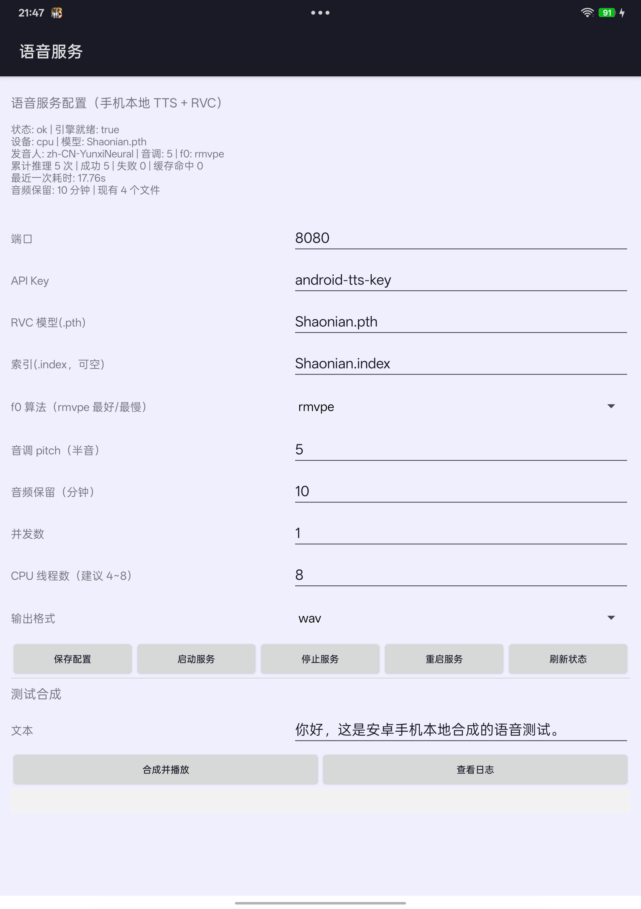

# 安卓版本语音处理端（手机本地跑 TTS + RVC）

把本项目原有的语音处理端**搬进安卓手机**：手机自己就是一个 tts-with-rvc 服务端，
局域网 / AstrBot 插件直接调用它即可。手机 App 负责改配置、启停服务和测试合成。

> **先看结论（关于 GPU）**：PyTorch 在安卓上**没有可用的 GPU 后端**（Adreno/Mali 不在支持列表里），
> 所以本方案是 **CPU 推理**。想在手机上用 GPU 跑 RVC，需要把模型转成 ONNX 并用
> ONNX Runtime 的 NNAPI/QNN 执行器重写推理链路，那是另一个量级的工程（见文末「关于 GPU」）。

---

## 一、整体结构

```text
安卓手机（已 root）
├── 语音服务 App（android-app 构建出的 APK）
│     ├─ 读写 /data/tts-rootfs/opt/tts-server/config.yaml（常用配置）
│     ├─ 启停服务：以 root 调用 /data/tts-ctl.sh
│     └─ 测试合成：HTTP 调 127.0.0.1:8080 → MediaPlayer 播放
│
└── Ubuntu 24.04 arm64 chroot（/data/tts-rootfs）
      └── /opt/tts-server/
            ├── app/      本项目 tts-server 代码（main/config/engine/storage）
            ├── python/   自带的 Python 3.12 + 全部依赖
            ├── models/   RVC 模型（.pth / .index）
            ├── hubert_base.pt、rmvpe.pt
            ├── output/   生成的音频（按配置自动清理）
            └── logs/     服务日志
```

局域网或 USB（adb forward）访问这台手机上的 `:8080` 即可，AstrBot 插件照常配置。

**为什么用 chroot**：安卓系统是 Bionic libc，而 PyTorch 等 aarch64 轮子要求 glibc。
手机已 root 时，用 Ubuntu arm64 极简 rootfs 做 chroot 最省事，性能损耗几乎为零
（不像 proot 那样需要 syscall 拦截）。

---

## 二、环境要求

| 项目 | 要求 |
| --- | --- |
| Root | KernelSU / Magisk 均可（本方案在 OnePlus + KernelSU 实测通过） |
| 存储 | ≥ 8GB（torch 与依赖占用较大） |
| 网络 | 首次安装需联网（约 1.5GB，脚本默认走清华镜像） |
| 电脑 | 已安装 adb，手机已开启 USB 调试 |

---

## 三、安装步骤（在电脑上执行）

```bash
cd <项目根目录>

# 1) 建立 Ubuntu arm64 chroot（下载 29MB rootfs 并解压到 /data/tts-rootfs）
adb push deploy/android/1_setup_rootfs.sh /data/local/tmp/
adb shell su -c "sh /data/local/tmp/1_setup_rootfs.sh"

# 2) 准备素材（服务端代码 + 配置 + 模型 + hubert/rmvpe 权重 + 自带 Python 运行时）
adb shell "mkdir -p /data/local/tmp/tts-src/app /data/local/tmp/tts-src/models /data/local/tmp/tts-src/assets"
adb push tts-server/main.py tts-server/config.py tts-server/engine.py tts-server/storage.py /data/local/tmp/tts-src/app/
adb push tools/tts_client.py /data/local/tmp/tts-src/app/
adb push deploy/android/android-config.yaml /data/local/tmp/tts-src/app/config.yaml
adb push <你的模型>.pth <你的索引>.index /data/local/tmp/tts-src/models/
adb push <RVC目录>/hubert_base.pt <RVC目录>/rmvpe.pt /data/local/tmp/tts-src/assets/
adb push python-arm64.tar.gz /data/local/tmp/tts-src/     # python-build-standalone aarch64

# 3) 安装进 chroot（apt + pip，首次约 20~40 分钟）
adb push deploy/android/2_install_server.sh deploy/android/install_inchroot.sh /data/local/tmp/
adb shell su -c "cp /data/local/tmp/install_inchroot.sh /data/local/tmp/tts-src/"
adb shell su -c "setsid nohup sh /data/local/tmp/2_install_server.sh > /data/local/tmp/install-run.log 2>&1 &"
adb shell "tail -40 /data/local/tmp/install-run.log"      # 看进度（安装会继续在后台跑）

# 4) 部署控制脚本（App 也找这个路径）
adb push deploy/android/ttsctl.sh /data/local/tmp/
```

控制脚本放在 `/data/local/tmp/ttsctl.sh` 即可（App 会优先找 `/data/tts-ctl.sh`，
找不到就用 `/data/local/tmp/ttsctl.sh`）。个别 KernelSU 版本对 `/data` 根目录下的新文件
有额外限制，放 `/data/local/tmp` 最稳。

```bash

# 5) 安装 App（仓库里已有构建好的 APK，也可用 build_apk.ps1 重新构建）
adb install -r android-app/dist/tts-server-config.apk
```

自带 Python 运行时下载地址（电脑上下载后 push）：

```text
https://github.com/astral-sh/python-build-standalone/releases/download/20260901/cpython-3.12.14+20260901-aarch64-unknown-linux-gnu-install_only_stripped.tar.gz
```

---

## 四、日常使用

### 1. 用 App（推荐）

打开「语音服务」App，可以：



- 修改 端口 / API Key / RVC 模型 / 索引 / f0 算法 / 音调 / 音频保留分钟 / 并发数 / **CPU 线程数** / 输出格式
- 一键 `保存配置`、`启动服务`、`停止服务`、`重启服务`
- `刷新状态`：设备、模型、累计推理次数、最近一次耗时、音频保留与文件数
- `合成并播放`：输入一句话直接试听（走完整 Edge TTS + RVC 流程）
- `查看日志`：服务端最近 60 行日志

> App 需要 root（KernelSU/Magisk 会弹窗，允许即可）。

### 2. 用命令行

```bash
adb shell su -c "sh /data/tts-ctl.sh start"        # 启动服务
adb shell su -c "sh /data/tts-ctl.sh status"       # 状态 + 健康检查
adb shell su -c "sh /data/tts-ctl.sh stop"         # 停止
adb shell su -c "sh /data/tts-ctl.sh test 你好呀"   # 合成一句话
adb shell su -c "sh /data/tts-ctl.sh logs 60"      # 查看日志
adb shell su -c "sh /data/tts-ctl.sh config"       # 查看当前配置
```

### 3. 让电脑 / AstrBot 访问手机上的服务

```bash
# A. 同一局域网（配置里 host 需为 0.0.0.0）
curl -H "Authorization: Bearer <API Key>" http://<手机IP>:8080/api/health

# B. 只走 USB：把手机端口映射到电脑本地
adb forward tcp:8080 tcp:8080
curl http://127.0.0.1:8080/api/health
```

AstrBot 插件里把 `tts_server.url` 指向上述地址之一，`api_key` 填 App 里设置的 Key 即可。

---

## 五、性能参考（Snapdragon 8 Gen 3 / 8 核，CPU 推理）

**实测数据**（OnePlus 机型、Snapdragon 8 Gen 3、rmvpe、8 线程、Ubuntu 24.04 chroot）：

| 场景 | 音频时长 | 生成耗时 | 实时倍率 |
| --- | --- | --- | --- |
| 短句「你好呀，这是手机本地合成的语音测试。」 | 4.16s | 11.55s | 2.78x |
| 中句（47~48 字，含标点） | 9.5s | 18.5~18.9s | ≈1.95x |
| 从电脑经 adb forward 调用（含网络传输） | 4.40s | 12.72s | 2.89x |
| 服务启动 + 模型预热 | — | 约 40 秒 | — |

对比参考：同样 7~10 秒音频，28 核 CPU 服务器约 6.5s（0.63x），桌面 8 核（7800X3D）约 8s（1.1x）。
**手机比桌面慢约 2.5 倍、比 28 核服务器慢约 4 倍**，符合移动端功耗与散热的预期。

| 场景 | 现象 |
| --- | --- |
| 服务启动（含模型预热） | 数十秒（加载 hubert + rmvpe + RVC 并做一次预热推理） |
| 短句（约 3 秒音频） | 数秒 ~ 十几秒 |
| 长句（约 7 秒音频） | 十几秒 ~ 数十秒 |
| 内存占用 | 常驻 2~3GB |

调优建议：

1. `CPU 线程数` 建议 4~6（手机大小核差异大，线程开太多反而更慢、更烫）；
2. `f0 算法`：`rmvpe` 音质最好但最慢，追求速度换 `pm` 或 `dio`（音质略降）；
3. AstrBot 插件侧 `voice.max_text_length` 建议 ≤ 100，避免几十秒的超长语音；
4. 连续合成会触发温控降频，属于正常现象。

---

## 六、关于 GPU（务必先读）

现状与可选路线：

| 路线 | 可行性 |
| --- | --- |
| PyTorch + 安卓 GPU | **不可行**：Adreno/Mali 没有 PyTorch 后端；官方 aarch64 轮子只有 CPU 版 |
| PyTorch + Vulkan | 实验特性，算子覆盖差，官方 pip 轮子不含，不建议 |
| ONNX Runtime + NNAPI | **可行但工作量大**：需把 hubert / rmvpe / net_g 全部导出 ONNX，用 Android 版 ORT（Java/C++）重写推理链路；算子不被 NNAPI 支持时会回落到 CPU，加速比不确定 |
| ONNX Runtime + QNN（高通 NPU） | 理论性能最好，但需 Qualcomm AI Hub / SNPE 工具链逐算子适配，属研究型工作 |

所以：**“手机 GPU 跑 RVC” 不是打包问题，而是模型转换 + 移动端推理引擎重写。**
如果确定要做，建议按下面顺序推进：

1. 在电脑上把 `net_g`（RVC 合成器）导出 ONNX，用 onnxruntime 跑通并与原音频对拍；
2. 同样处理 `rmvpe`（音高提取）与 hubert（内容编码），或直接采用社区已有的 ONNX 版本；
3. 写一个 Android 端（Java/Kotlin + ORT Android AAR）把三段串起来，先跑 CPU EP 验证正确性；
4. 再启用 NNAPI/QNN EP，逐层确认算子是否落到 GPU/NPU，评估加速比与音质损失。

`android-app/` 这个 App 已经包含配置与测试能力，可以直接作为第 3 步的壳。

---

## 七、常见问题

| 现象 | 处理 |
| --- | --- |
| App 点启动没反应 | 确认 App 已获得 root 权限；`adb shell su -c "sh /data/tts-ctl.sh start"` 看具体报错 |
| `chroot: permission denied` | root 未生效，先 `adb shell su -c id` 确认 |
| apt 报证书错误 | 脚本已默认使用 http 清华源（极简 rootfs 缺 CA 包） |
| pip 安装很慢 | `praat-parselmouth`、`pyworld`、`fairseq` 需现场编译，手机上要十几分钟 |
| 服务启动后立刻退出 | `sh /data/tts-ctl.sh logs 60` 看日志：常见是模型没放对或 config.yaml 损坏 |
| 合成慢 / 手机发烫 | 降低线程数、改用 `pm`/`dio`、缩短文本；避免边充电边长时间合成 |
| 重启后服务没了 | 当前是手动启动；要常驻可把启动命令放进 `/data/adb/service.d/`（root 方案开机自启目录） |

---

## 八、装机时踩到的 5 个坑（脚本已全部处理）

安卓 + Python 3.12 + glibc chroot 这套组合有不少坑，`install_inchroot.sh`
与配套脚本都已修好；记录原因便于以后排查：

| # | 现象 | 原因与修法 |
| --- | --- | --- |
| 1 | `mktemp: No such file or directory`，apt/dpkg 连锁失败 | 安卓的 `TMPDIR=/data/local/tmp` 被带进 chroot，而 chroot 内没有该目录；脚本统一 `export TMPDIR=/tmp` |
| 2 | `pip install torch` 装了 5.2GB，还带一堆 nvidia 库 | PyPI 上 aarch64 的 torch 轮子是 CUDA 版；改用 `--index-url https://download.pytorch.org/whl/cpu`（torch 2.9.1+cpu） |
| 3 | `import faiss` 报 `No module named 'numpy.distutils'` | numpy 1.26 在 Python 3.12 上不再提供 `numpy.distutils`，而 faiss 1.10 用它探测 ARM SVE；`fix_numpy_distutils.sh` 补了一个"报告无 SVE"的最小实现 |
| 4 | 引擎初始化报 `No module named 'pkg_resources'` | setuptools 84 移除了 `pkg_resources`，而 librosa/fairseq 仍在用；把 setuptools 降到 `setuptools<81` |
| 5 | `joblib will operate in serial mode` | chroot 里没有 `/dev/shm`（torch/joblib 需要共享内存）；脚本会挂 512MB tmpfs 到 `/dev/shm` |

另外：`praat-parselmouth` 在 aarch64 上只有源码包，需要编译整套 Praat（手机上要几十分钟）。
本项目默认用 `rmvpe` 提取音高、用不到它，因此脚本放入一个轻量替身；
只有把 `f0_method` 改成 `pm` 时才需要安装真包。

首次完整安装（含全部依赖编译）在手机上约需 **40~60 分钟**，之后重启服务只需几秒。
